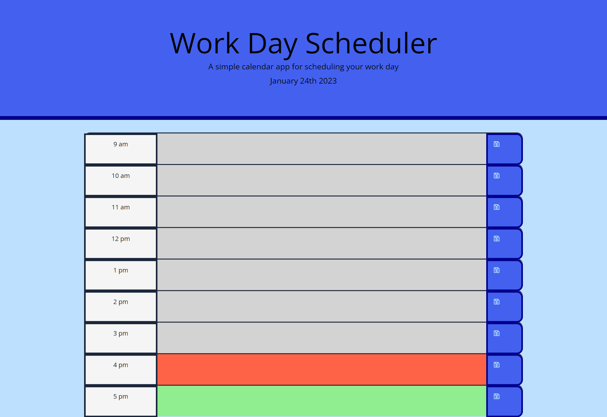

# Day-Planner

A Day Planner With Local Storage.

## Features

The application allows the user to list the tasks during office hours.
Jumbotron section shows the current date in "MM DD YYYY" format, below page heading. An external library "Moment.js" is used to fetch the date.
Some external libraries jquerry are also linked to append the rows etc.
Rows are highlighted by colors defining the past, current and upcoming hours.
The text area allows the user to input the tasks.
The save button with animation, when clicked stores the input in local storage. This means that refreshing or restarting wil not remove the input value.

##  Usage

Open the app in google and simply type in the tasks. If you refresh or restart without clicking on the save button the tasks will disappear. On the other hand if you click the save button refreshing or restarting the browser will have no affect on the input as it stays there and is stored in local storage. 

## Sreenshot

